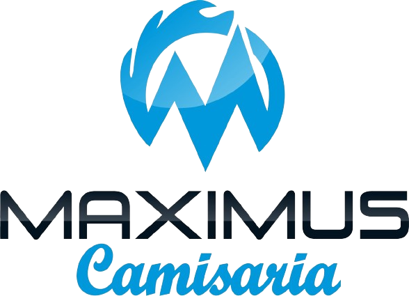

# MaximusCamisaria



## Sobre o Projeto

Desenvolvimento de um site que permita a divulgação da marca para outras regiões do país e contribuindo para a ampliação dos negócios da empresa.

## Integrantes

- BÁRBARA FERREIRA GOMES - barbara.gomes.setelagoas@uniatenas.edu.br
- CECÍLIA FIGUEIREDO COMBAT - figueiredoceci2004@gmail.com
- MARCELLE RABELO RODRIGUES BANDEIRA - marcellebandeira@uniatenas.edu.br
- RENATA AROUCA SANTOS - renata.santos.valenca@uniatenas.edu.br
- RENATA JAMILE RODRIGUES DE OLIVEIRA - renata.oliveira@uniatenas.edu.br

## Como Usar

Este projeto foi desenvolvido utilizando o framework Flask, executado no Visual Studio Code (VS Code). As linguagens de programação utilizadas incluem Python para a lógica de backend, HTML para a estrutura das páginas web, CSS para a estilização e JavaScript para funcionalidades dinâmicas no frontend.

### Pré-requisitos

Certifique-se de ter o Python e o Virtualenv instalados em sua máquina. Você também precisará do Visual Studio Code como seu ambiente de desenvolvimento integrado (IDE).

### Passo a Passo para Configuração e Execução

1. **Clone o Repositório**

   Clone este repositório para sua máquina local:

   ```bash
   git clone https://github.com/renatajamile/MaximusCamisaria.git


2. **Crie e Ative um Ambiente Virtual**

      Navegue até o diretório do projeto e crie um ambiente virtual:

      cd MaximusCamisaria
      python -m venv venv

      **Ative o ambiente virtual:**

      No Windows: venv\Scripts\activate

      No macOS/Linux: source venv/bin/activate

3. **Instale as Dependências**

      Instale as dependências do projeto listadas no arquivo requirements.txt: 

      pip install -r requirements.txt

4. **Configuração do Banco de Dados**

      Configure o banco de dados conforme necessário. Execute as migrações para criar as tabelas no banco de dados:

      flask db upgrade

5. **Execute a Aplicação**

      Com todas as dependências instaladas e o banco de dados configurado, você pode executar a aplicação Flask:

      flask run

      A aplicação estará disponível em http://127.0.0.1:5000/

### Estrutura do Projeto
app.py: Arquivo principal para inicialização da aplicação Flask.
/templates: Contém os arquivos HTML renderizados pelo Flask.
/static: Contém os arquivos estáticos como CSS, JavaScript e imagens.
/models: Definições dos modelos de dados.
/routes: Definição das rotas da aplicação.

### Funcionalidades Principais
Sistema de Login/Registro: Autenticação de usuários.

Catálogo de Produtos: Exibição de produtos disponíveis.

Personalização de Camisetas: Incluir Pedidos de Camisetas para orçamento.

Fale Conosco: Canal de comunicação com a empresa.

Minha Conta: Espaço do cliente para visualização/alteração de dados do perfil do usuário.

Carrinho de Compras: Adicionar e remover itens do carrinho. 

Avaliação: Envio de avaliação e experiência do usuário.

Envio de orçamentos: (Em construção).

Finalização de Compra: Processo de checkout e confirmação de pedido.(Em construção).

Ambiente Admin.: (Em construção).

### Tecnologias Utilizadas
Flask: Framework web usado para o desenvolvimento do backend.

Python: Linguagem de programação principal para a lógica do servidor.

HTML/CSS: Para estruturação e estilização das páginas web.

JavaScript: Para funcionalidades interativas e dinâmicas no frontend.

SQLite: Banco de dados utilizado para armazenar informações.

## Conclusão

Seguindo esses passos, você estará pronto para utilizar e explorar todas as funcionalidades do projeto MaximusCamisaria. 

Se precisar de mais ajuda, consulte a documentação do Flask ou entre em contato com um dos integrantes do projeto.
